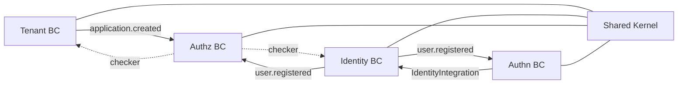
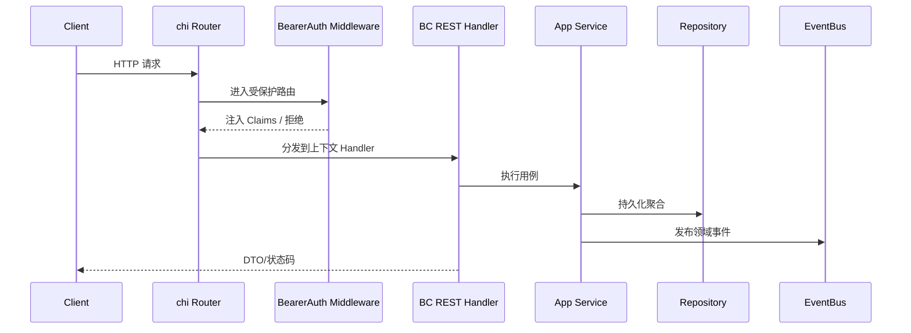

# OpenIAM 系统总览设计

本文描述 OpenIAM 的整体领域划分、限界上下文关系、运行时装配与核心业务主链路。

## 1. 领域目标与核心子域

OpenIAM 当前围绕 IAM 核心能力构建，包含四个核心限界上下文：

- Tenant：租户与应用生命周期管理
- Identity：用户身份生命周期与基础资料管理
- Authz：角色、权限与访问控制决策
- Authn：认证、会话与令牌管理

共享内核位于 `internal/shared`，提供：

- 统一 ID 类型（`UserID`、`TenantID`、`AppID` 等）
- 聚合事件基类（`AggregateRoot`）
- 领域事件总线接口（`EventBus`）
- 事务抽象（`TxManager`）

## 2. 上下文地图（Context Map）



关系说明：

- Authn 通过防腐适配（`identityBridge`）调用 Identity 应用服务，不直接依赖其存储实现。
- Authz 通过订阅 `application.created` / `user.registered` 完成角色和权限编排。
- Tenant 与 Identity 的 REST Handler 受 Authz checker 控制（如果系统装配了 Authz）。

## 3. 运行时装配（Composition Root）

组合根在 `pkg/iam.go`，通过 Option 模式装配基础设施和模块：

- 基础设施：`WithPostgres`、`WithRedis`、`WithEventBus`、`WithLogger`
- 模块：`WithIdentity`、`WithAuthn`、`WithAuthz`、`WithTenant`

`WithAuthn` 的关键点是将基础设施实现映射为 `authn.AuthenticatorDeps` 的端口依赖：

- `CredentialRepository`（Postgres）
- `SessionRepository` / `ChallengeStore`（Redis）
- `TokenProvider`（JWT）
- `IdentityIntegration`（identity bridge）

```mermaid
flowchart TD
  A[iam.New(opts)] --> B[ensureDefaults]
  B --> C[WithIdentity]
  C --> D[WithAuthn]
  D --> E[WithAuthz]
  E --> F[lateBindChecker]
  F --> G[WithTenant]
  G --> H[Engine.Handler]
```

## 4. 统一请求链路（HTTP）



## 5. 事件驱动主线

系统当前的跨上下文主线：

1. Tenant 创建应用 -> 发布 `application.created`
2. Authz 订阅后：
   - 初始化系统角色（含 `super_admin`、`admin`、`member`）
   - 同步内建权限定义
   - 给创建者分配 `super_admin`
3. Identity 注册用户 -> 发布 `user.registered`
4. Authn 订阅后创建凭据（`Credential`）
5. Authz 订阅后给用户自动分配 `member`（若存在）

## 6. 当前架构风格与边界

- **已采用**
  - DDD 分层（domain/application/adapter）
  - 组合根集中装配
  - 端口-适配器（尤其 Authn 边界）
  - 领域事件驱动跨上下文协作
- **边界约束**
  - 上下文之间只通过显式接口或事件协作
  - shared 仅承载通用内核，不承载业务规则
