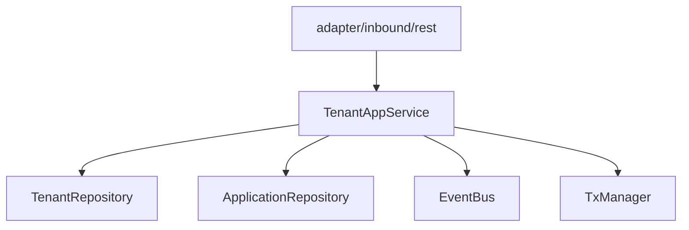
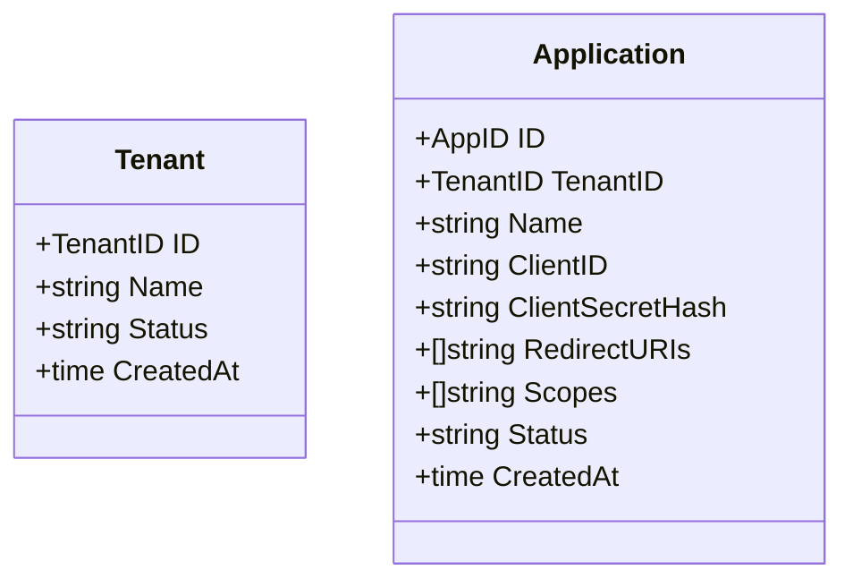
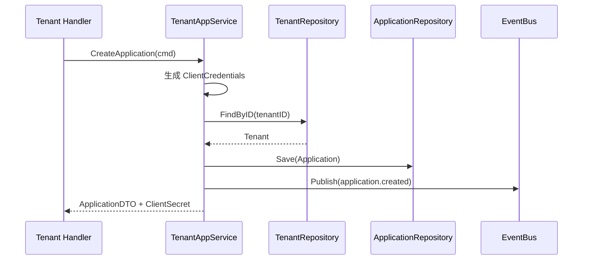
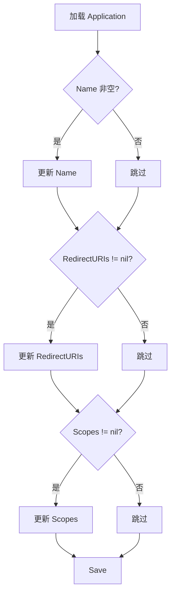

# Tenant 限界上下文设计

## 1. 责任边界

Tenant 上下文负责：

- 租户创建与查询
- 应用（App）创建、查询、列表、更新
- 应用客户端凭据生成（ClientID / ClientSecretHash）
- 发布 `tenant.created`、`application.created` 领域事件

不负责认证、授权决策和用户认证资料。

## 2. 分层结构

模块装配在 `internal/tenant/module.go`：

- `NewManager(db, bus, txMgr, check)`
- 若存在 `check`（Authz checker），才初始化 REST Handler

## 3. 领域模型（实体与聚合）

聚合说明：

- `Tenant`：租户聚合根，创建时记录 `TenantCreatedEvent`
- `Application`：应用聚合根，创建时记录 `ApplicationCreatedEvent`

## 4. 应用服务用例

`TenantAppService` 提供：

- `CreateTenant`
- `GetTenant`
- `CreateApplication`
- `GetApplication`
- `ListApplications`
- `UpdateApplication`

事务边界：

- `CreateTenant`、`CreateApplication`、`UpdateApplication` 在 `TxManager.Execute` 中执行业务写入。
- `CreateTenant` / `CreateApplication` 在事务内持久化并发布聚合事件。

## 5. 关键流程

### 5.1 创建应用

### 5.2 更新应用

## 6. 发布事件

- `tenant.created`
- `application.created`（会触发 Authz 侧的角色/权限初始化）

## 7. 与其他上下文交互

- 向 Authz 提供 `application.created` 事件输入
- 自身受 Authz checker 保护（路由层）
