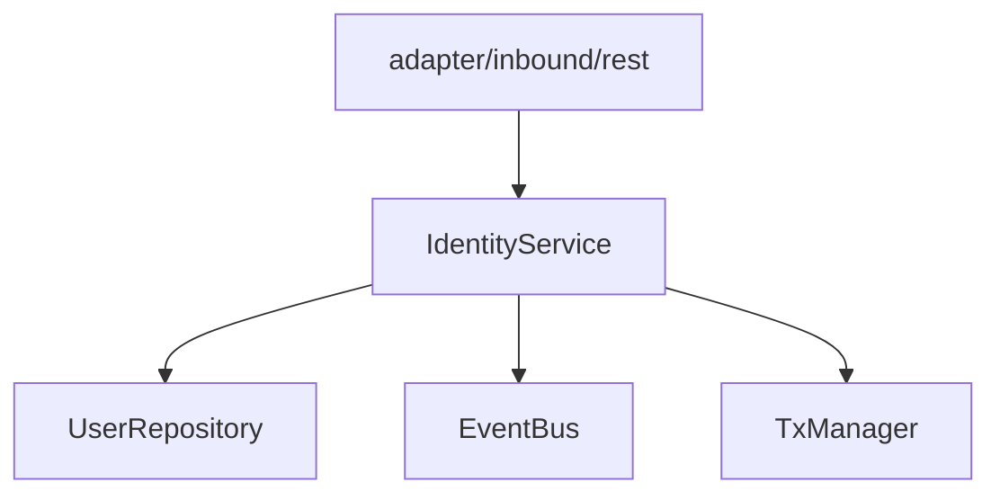
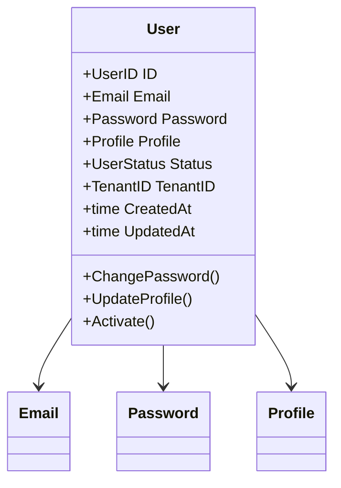
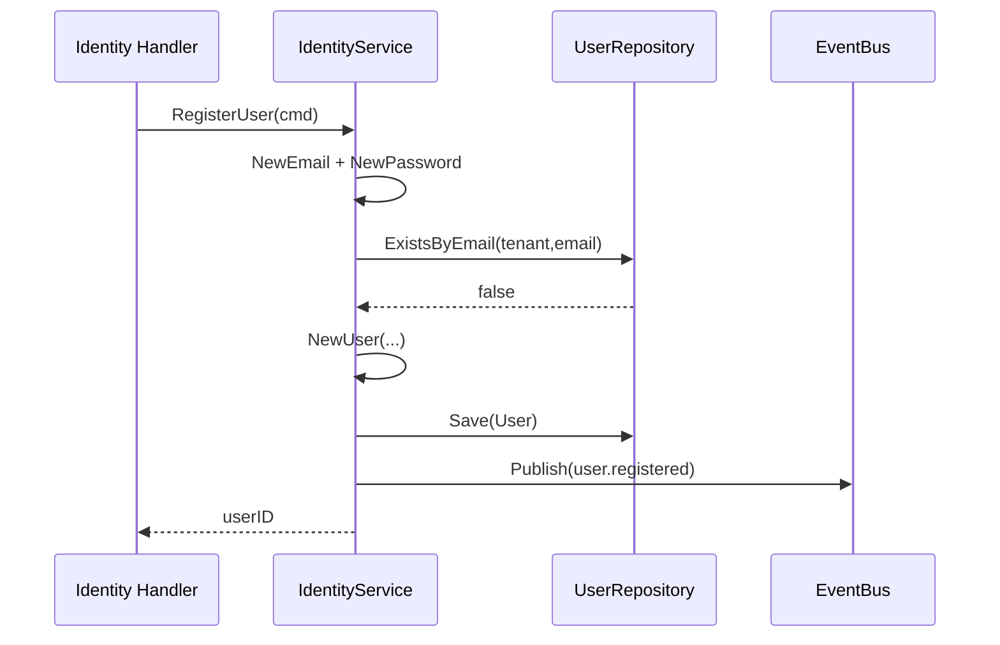

# Identity 限界上下文设计

## 1. 责任边界

Identity 上下文负责：

- 用户注册（密码用户、外部身份用户）
- 用户资料查询与更新
- 密码修改
- 发布用户生命周期事件（尤其 `user.registered`）

不负责会话令牌、权限决策、认证策略细节。

## 2. 分层结构



模块装配在 `internal/identity/module.go`：

- `NewRegistry(db, bus, txMgr, check)`
- 存在 checker 时才创建受保护 REST Handler

## 3. 领域模型（实体与值对象）



聚合根：

- `User` 是 Identity 上下文唯一核心聚合根

## 4. 应用服务用例

`IdentityService`：

- `RegisterUser`
- `RegisterExternalUser`
- `GetUser`
- `ChangePassword`
- `UpdateProfile`
- `FindByEmail`

## 5. 关键流程

### 5.1 普通用户注册（密码）



### 5.2 外部身份注册（供 Authn 调用）

```mermaid
flowchart TD
  A[RegisterExternalUser] --> B[tenantID 为空则 default]
  B --> C[NewExternalUser]
  C --> D[FindByEmail(占位邮箱)]
  D -->|已存在| E[返回 existing.ID]
  D -->|不存在| F[Save User]
  F --> G[Publish user.registered]
  G --> H[返回新 userID]
```

## 6. 发布事件

- `user.registered`（最关键，驱动 Authn/Authz）
- `user.activated`
- `user.password_changed`

## 7. 与其他上下文交互

- **被 Authn 调用**：Authn 通过 `IdentityIntegration` 调用 `RegisterUser` / `RegisterExternalUser` / `GetUser`
- **驱动 Authn**：`user.registered` 触发 Authn 创建凭据
- **驱动 Authz**：`user.registered` 触发 Authz 自动角色分配（member）
