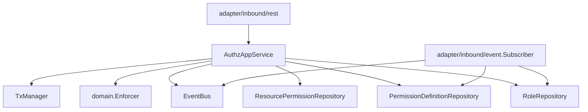
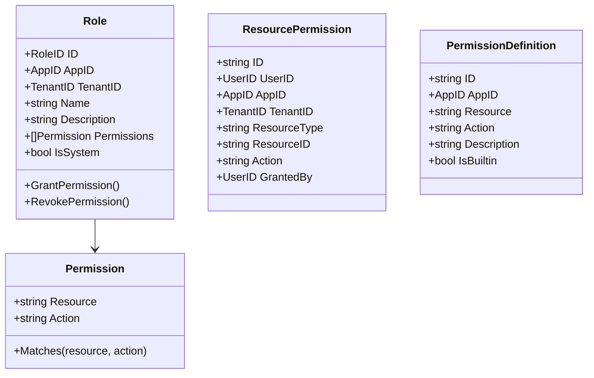
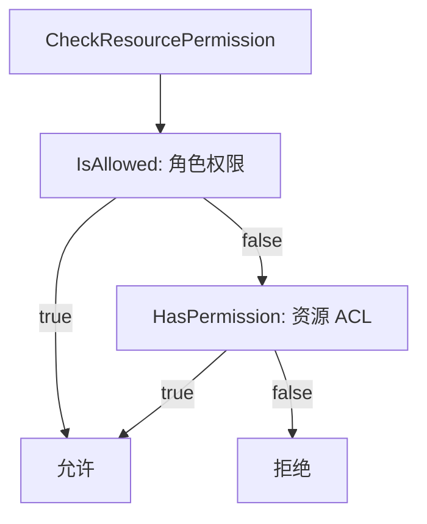
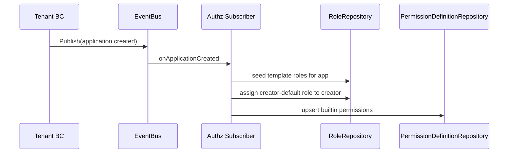

# Authz 限界上下文设计

## 1. 责任边界

Authz 上下文负责：

- 角色（Role）与权限（Permission）管理
- 用户-应用角色关联（UserAppRole）
- 资源级 ACL（ResourcePermission）
- 权限定义注册（PermissionDefinition）
- 统一鉴权决策（`Checker` / `Enforcer`）
- 订阅跨上下文事件并完成权限编排
- 保证角色与应用隔离（Role-App boundary）

## 2. 分层结构

## 3. 领域模型（实体与聚合）

聚合视角：

- `Role` 是核心业务聚合根（权限增删作为聚合内不变量）
- `ResourcePermission` / `PermissionDefinition` 当前以记录模型为主，通过仓储维护

## 4. 应用服务用例

`AuthzAppService` 包含：

- Role 管理：`CreateRole`、`DeleteRole`、`ListRoles`
- 授权管理：`AssignRole`、`UnassignRole`
- 权限管理：`GrantPermission`、`RevokePermission`
- 资源 ACL：`GrantResourcePermission`、`RevokeResourcePermission`、`ListResourcePermissions`
- 权限定义：`RegisterPermission`、`DeletePermissionDefinition`、`ListPermissionDefinitions`
- 决策：`CheckPermission`、`CheckResourcePermission`

关键约束（新增）：

- `AssignRole` 必须校验 `role.app_id == cmd.app_id`，跨应用绑定直接拒绝。
- `AssignRole` 对重复绑定保持幂等：不重复写入、不重复发布 `RoleAssignedEvent`。
- `CreateRole` / `AssignRole` 做基础输入校验（空 `app_id`、空 `role_id`、空白 `name` 直接返回 `ErrInvalidInput`）。

## 5. 决策模型

`domain.Enforcer` 判定流程：

## 6. 事件订阅编排

Authz 在 `adapter/inbound/event/subscriber.go` 中订阅：

- `application.created`
  - 基于模板初始化系统角色：`super_admin` / `admin` / `member`
  - 给创建者分配 creator-default 角色（默认 `super_admin`）
  - 同步内建权限定义（BuiltinPermissions）
- `user.registered`
  - 查找默认 `member` 角色
  - 自动给新用户分配角色

错误处理约束（新增）：

- `user.registered` 流程中，仅 `ErrRoleNotFound` 视为可跳过；其余仓储错误必须上抛。
- `application.created` 流程中，模板读取失败必须上抛，不再静默降级。

## 7. 对外能力

`NewAuthorizer` 生成 `Checker`（闭包）：

- 从上下文读取 Claims
- 调用 `CheckPermission`
- 不允许时返回 `ErrForbidden`

Tenant / Identity 路由可直接复用该 checker 进行资源鉴权。

## 8. 数据一致性防线（新增）

- 读取用户角色时，仓储层要求 `uar.app_id = roles.app_id`，防止历史脏数据造成跨应用权限串联。
- 写入用户角色时，仓储层仅允许 `role_id` 属于目标 `app_id` 的记录落库。
