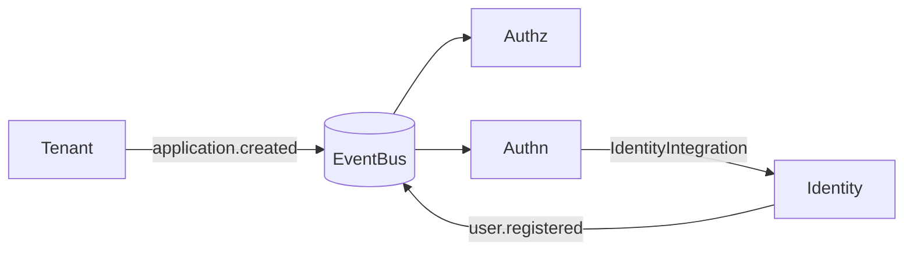
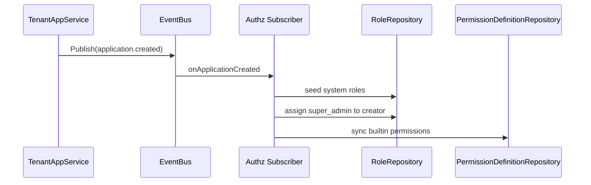
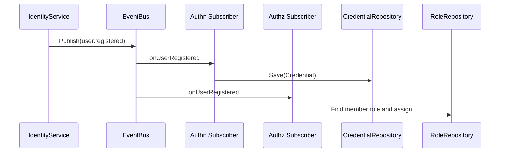
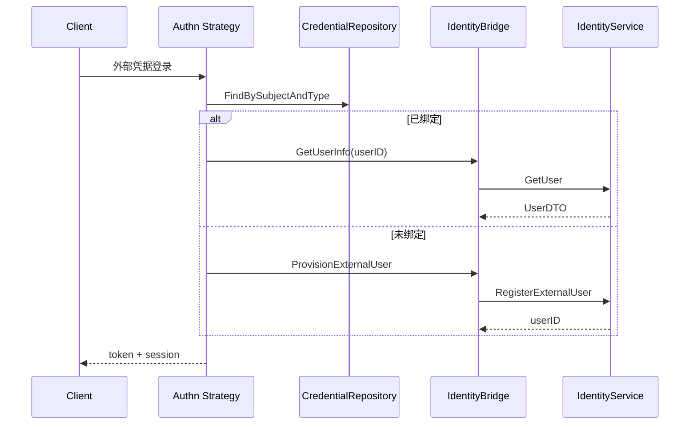

# 限界上下文交互设计

本文聚焦跨上下文协作，不重复上下文内部细节。

## 1. 交互类型总览

OpenIAM 使用两种跨上下文交互方式：

- 同步调用（端口适配）
  - Authn -> Identity（`IdentityIntegration`）
- 异步事件（EventBus）
  - Tenant -> Authz（`application.created`）
  - Identity -> Authz/Authn（`user.registered`）



## 2. 关键交互 1：创建应用后的授权编排

触发源：Tenant `CreateApplication`



一致性特点：

- 业务写库与事件发布在各自事务边界内完成
- 当前实现为内存总线同步处理，订阅者失败会回传错误

## 3. 关键交互 2：注册用户后的凭据与角色编排

触发源：Identity `RegisterUser` / `RegisterExternalUser`



收益：

- Identity 保持纯身份职责
- Authn/Authz 可独立演进事件处理策略

## 4. 关键交互 3：认证中跨上下文读写

SIWE / WebAuthn 首次登录路径：



## 5. 鉴权链路交互

```mermaid
flowchart TD
  A[BearerAuth middleware] --> B[TokenProvider.Validate]
  B --> C[Claims 注入 Context]
  C --> D[业务 Handler]
  D --> E[Authz Checker(resource, action)]
  E --> F[AuthzAppService.CheckPermission]
  F --> G[Enforcer]
```

说明：

- Tenant / Identity REST Handler 在模块初始化时接入 checker
- 若未装配 Authz，相关 Handler 不会创建（天然关闭受保护写接口）

## 6. 依赖方向与治理原则

约束原则：

1. 上下文内依赖指向 domain 接口，不直接指向外部上下文持久化实现
2. 跨上下文写操作优先事件化
3. 跨上下文查询通过窄接口（如 `GetUserInfo`）完成
4. 组合根统一装配，避免上下文自行 new 外部基础设施

## 7. 可演进方向

- 将内存事件总线替换为可靠消息中间件（outbox + retry）
- 细化事件版本（例如 `user.registered.v1`）
- 将 Authz 默认角色策略改为可配置策略源
- 为跨上下文链路补充契约测试（事件 payload 与端口契约）
